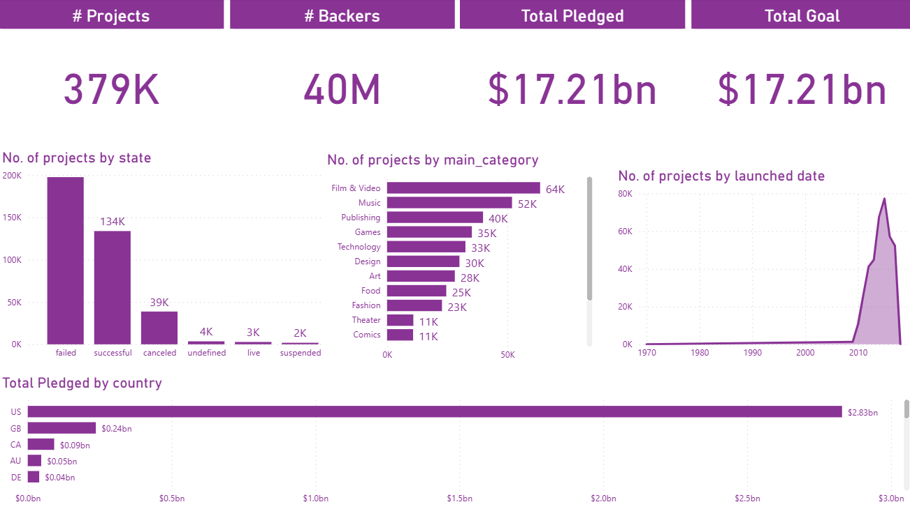

# Kickstarter Projects Analytics Dashboard 📊

> An interactive business intelligence dashboard analyzing 379K+ Kickstarter projects to uncover what makes a crowdfunding campaign succeed or fail.

---

## 📌 Overview

Kickstarter has hosted hundreds of thousands of projects across dozens of categories since its launch. This dashboard was built to answer a simple but critical question: **what separates a successful campaign from a failed one?**

Using Power BI, I analyzed the 2018 Kickstarter dataset covering 379K projects, 40M backers, and $17.21bn in total pledged funding. The result is a single-page interactive dashboard that gives a clear picture of campaign performance across categories, countries, and time.

---

## 🖼️ Dashboard Preview



---

## 🔍 Key Insights

- Out of 379K projects, only **134K succeeded** while **197K failed**, a success rate of just 35%
- **Film and Video** leads all categories with **64K projects**, followed by Music at **52K**
- The **US dominates** total pledged funding at **$2.83bn**, far ahead of GB at $0.24bn
- Kickstarter activity **peaked around 2014-2015** before declining significantly
- Total pledged and total goal are both **$17.21bn**, suggesting campaigns collectively hit their targets on average

---

## 📊 Dashboard Sections

| Section | Description |
|---------|-------------|
| KPI Cards | Total projects, backers, pledged amount, and goal at a glance |
| No. of Projects by State | Bar chart showing failed, successful, canceled, undefined, live, and suspended campaigns |
| No. of Projects by Category | Drill Down chart using Project Hierarchy from Main Category to Category to Project Name |
| No. of Projects by Launch Date | Area chart showing campaign volume trends from 1970 to 2018 |
| Total Pledged by Country | Horizontal bar chart comparing pledged amounts across top countries |

---

## 🗂️ Data Hierarchy

A custom **Project Hierarchy** was created to enable Drill Down navigation across three levels:

```
Main Category
    └── Category
            └── Project Name
```

This allows users to explore campaign data from the broadest category level down to individual project names in a single visual.

---

## 📐 DAX Measures

All KPI cards are powered by custom measures:

| Measure | Description |
|---------|-------------|
| `# Projects` | Count of all projects in the dataset |
| `# Backers` | Total number of backers across all campaigns |
| `Total Pledged` | Sum of all pledged amounts |
| `Total Goal` | Sum of all campaign funding goals |

---

## 🛠️ Tools and Techniques

| Tool | Usage |
|------|-------|
| **Power BI Desktop** | Dashboard design and development |
| **Power Query** | Table renaming, column cleanup, and data transformation |
| **DAX** | Custom measures and Project Hierarchy |
| **Kickstarter Dataset (2018)** | 379K crowdfunding campaigns with project details |

**Visualizations used:** KPI cards, Bar charts, Horizontal bar charts, Area chart, Drill Down hierarchy

---

## 📁 Dataset

This project uses the **Kickstarter Projects dataset (2018)** from Kaggle.

The dataset contains two files covering 2016 and 2018. This dashboard was built using the **2018 file only**.

🔗 [View Dataset on Kaggle](https://www.kaggle.com/kemical/kickstarter-projects)
